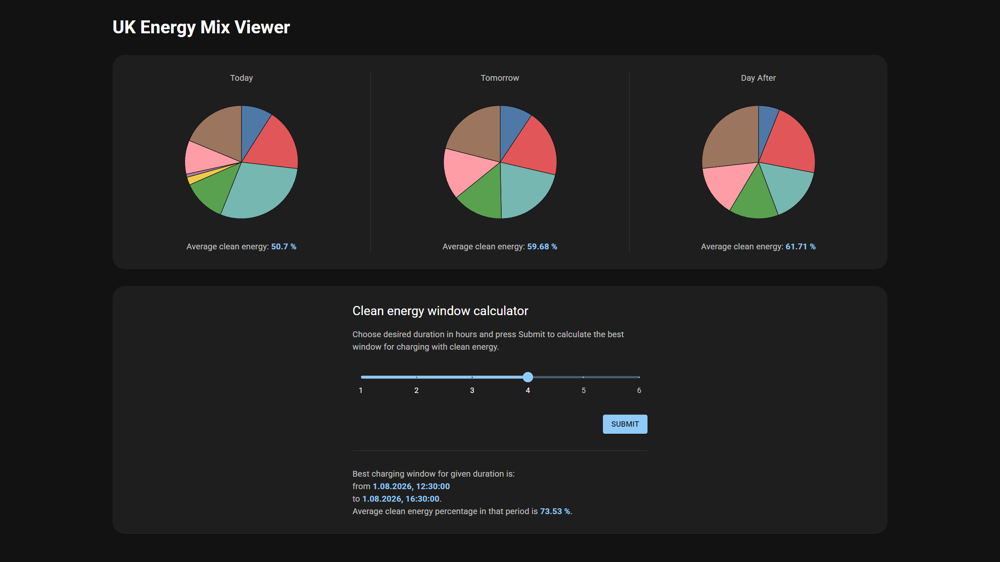

ASP.NET Core backend for an energy mix viewer app.

Frontend: [https://github.com/szanuj/mixview-frontend](https://github.com/szanuj/mixview-frontend)

---

### Features

- View current and predicted energy mix for UK using public [Carbon Intensity API](https://carbon-intensity.github.io/api-definitions/?shell#get-generation-from-to).
- Calculate optimal time window for charging a car, maximizing clean energy share.

### Screenshot

### Tech

**Backend:** .NET Core, C#

API endpoints:

- GET `/`: Average energy mix for today, tomorrow, and the day after.
- GET `/charge/{duration}`: Optimal time window for charging car on clean energy, given duration.

**Frontend:** React, Vite, TypeScript, MUI

- openapi-fetch, openapi-react-query to generate types and wrap API.
- react-query to call API.
